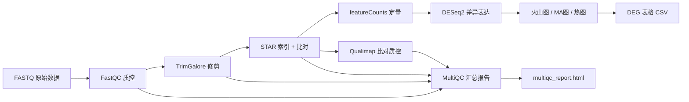

# rnaseq-nf — 可复现 RNA-seq 高通量分析流水线

**Reproducible high-throughput RNA-seq analysis pipeline**

A complete, production-grade Nextflow + Docker pipeline that goes from raw
sequencing reads all the way to differential expression tables and publication
figures — fully containerized, so it runs anywhere the same way.

一条从原始测序 reads 到差异表达表格与发表级图表的完整、可复现的
Nextflow + Docker 流水线，全程容器化，任何机器上跑出来的结果都一致。

---

## 目录 / Table of contents

- [流水线总览 Overview](#-流水线总览-overview)
- [分析流程 Pipeline stages](#-分析流程-pipeline-stages)
- [环境要求 Requirements](#-环境要求-requirements)
- [快速开始 Quick start](#-快速开始-quick-start)
- [输入与输出 Input & output](#-输入与输出-input--output)
- [参数说明 Parameters](#-参数说明-parameters)
- [结果解读 Interpreting results](#-结果解读-interpreting-results)
- [复现性 Reproducibility](#-复现性-reproducibility)
- [目录结构 Repository layout](#-目录结构-repository-layout)
- [常见问题 Troubleshooting](#-常见问题-troubleshooting)
- [许可 License](#-许可-license)

---

## 🧬 流水线总览 Overview



**技术栈 / Tech stack**

| 组件 Component | 工具 Tool | 用途 Purpose |
|---|---|---|
| 工作流引擎 | Nextflow (DSL2) | 编排、并行、容错、日志 |
| 容器化 | Docker | 每步独立镜像，复现无忧 |
| 质控 QC | FastQC + MultiQC | 原始数据与全流程质控 |
| 修剪 Trim | TrimGalore | 去接头、去低质量碱基 |
| 比对 Align | STAR | 剪接感知比对（RNA-seq 金标准） |
| 定量 Quantify | featureCounts (Subread) | 基因级 read 计数 |
| 差异分析 DE | DESeq2 (R/Bioconductor) | 归一化 + 差异表达 |
| 比对质控 | Qualimap | 覆盖度、比对质量 |

---

## 🔬 分析流程 Pipeline stages

1. **FastQC** — 对原始 FASTQ 做每碱基质量、GC 含量、重复、接头污染检查。
   *Raw read quality control: per-base quality, GC, duplication, adapter contamination.*

2. **TrimGalore** — 用 Cutadapt 去除接头、polyA 尾与低质量碱基（默认 Q20、长度 ≥ 20bp）。
   *Adapter + low-quality base trimming.*

3. **STAR indexing** — 一次性构建参考基因组索引（供所有样本复用，只跑一次）。
   *Build spliced-alignment genome index once.*

4. **STAR alignment** — 剪接感知双端比对，输出按坐标排序的 BAM，并启用 `GeneCounts`。
   *Splice-aware paired-end alignment to sorted BAM.*

5. **featureCounts** — 对 BAM 做基因级定量，生成 raw counts 矩阵。
   *Gene-level read quantification to a raw count matrix.*

6. **DESeq2** — 归一化（中位比值法）、负二项分布建模、Wald 检验，输出差异表达表 + 火山图/MA 图/热图。
   *Normalization + NB modeling + Wald test → DEG table and figures.*

7. **Qualimap** — 比对后质控：外显子/内含子/基因间区覆盖比例、5'→3' 偏好等。
   *Post-alignment QC: coverage profiles, strand specificity.*

8. **MultiQC** — 将以上所有报告汇总为单一 HTML。
   *Aggregate every QC report into one HTML.*

---

## 🖥️ 环境要求 Requirements

| 依赖 Dependency | 版本 Version | 说明 Notes |
|---|---|---|
| Nextflow | ≥ 23.04 | 本仓库已附带 `bin/nextflow` |
| Docker | 20.10+ | 需可正常 `docker run hello-world` |
| Java | 11–21 | Nextflow 运行时需要（Docker 版 Nextflow 可免） |
| 磁盘 Disk | ≥ 10 GB | 完整参考基因组需更多 |

> 本项目所有分析工具均来自 Docker 镜像，**无需**在本机安装 STAR/DESeq2 等，
> 唯一需要本地装的是 Docker 与 Nextflow。

---

## 🚀 快速开始 Quick start

### 1. 准备参考基因组 / Prepare reference

```bash
# 完整 GRCh38（较大，约 3 GB）
bash scripts/download_reference.sh        # 输出到 refs/

# 或演示用 chr21 子集（推荐先在本地跑通，几 MB）
bash scripts/download_reference.sh --mini
```

### 2. 准备输入数据 / Prepare input reads

把 FASTQ 放到 `data/reads/`，然后编辑 `data/samplesheet.csv` 指定每行一个样本：

```csv
sample,condition,fastq_1,fastq_2
control_rep1,control,data/reads/control_rep1_R1.fastq.gz,data/reads/control_rep1_R2.fastq.gz
treat_rep1,treat,data/reads/treat_rep1_R1.fastq.gz,data/reads/treat_rep1_R2.fastq.gz
```

> 演示用真实公开数据可运行 `bash scripts/download_demo_data.sh`（来自 NCBI SRA）。

### 3. 运行流水线 / Run the pipeline

```bash
nextflow run main.nf \
  --genome_fasta refs/genome.fa \
  --gtf refs/genes.gtf \
  --contrast treat,control \
  -profile docker \
  -resume
```

> 本仓库已附带 Nextflow，也可用：`java -jar bin/nextflow run main.nf ...`

运行结束后，结果在 `results/`：

```
results/
├── pipeline_info/
│   ├── execution_report.html
│   ├── execution_timeline.html
│   ├── pipeline_dag.svg
│   └── execution_trace.txt
├── multiqc_report.html
├── deseq2_results.csv         # 全部基因差异表达结果
├── deseq2_significant.csv     # 显著 DEG（padj<0.05 且 |log2FC|≥1）
├── volcano.pdf                # 火山图
├── ma_plot.pdf                # MA 图
└── heatmap_top50.pdf          # Top50 显著 DEG 热图
```

---

## 📥 输入与输出 Input & output

### 输入 Input

- **samplesheet.csv**：样本与实验设计（见上）。
- **参考 FASTA** 与 **GTF**：Ensembl GRCh38（脚本自动下载）。
- **adapter 文件**：`assets/adapters.fa`（已内置常用接头）。

### 输出 Output

| 文件 File | 说明 Description |
|---|---|
| `multiqc_report.html` | 全流程质控汇总 |
| `deseq2_results.csv` | 每个基因的 log2FC、padj 等 |
| `deseq2_significant.csv` | 显著差异基因列表 |
| `volcano.pdf` / `ma_plot.pdf` | 差异表达可视化 |
| `heatmap_top50.pdf` | Top50 DEG 表达热图 |
| `pipeline_info/*` | 执行报告、时间线、DAG 图、trace |

---

## ⚙️ 参数说明 Parameters

| 参数 Parameter | 默认 Default | 说明 Description |
|---|---|---|
| `--reads` | `data/samplesheet.csv` | 样本表路径 |
| `--genome_fasta` | — | 参考基因组 FASTA |
| `--gtf` | — | 基因注释 GTF |
| `--contrast` | — | 对比，格式 `A,B`（A vs B） |
| `--stranded` | `no` | 链特异性 `no/yes/reverse` |
| `--single_end` | `false` | 单端测序模式 |
| `--min_trim_len` | `20` | 修剪后最短 read 长度 |
| `--star_threads` | `8` | STAR 比对线程数 |
| `--outdir` | `results` | 结果输出目录 |

**常用示例 / Examples**

```bash
# 单端、反向链特异数据
nextflow run main.nf --genome_fasta refs/genome.fa --gtf refs/genes.gtf \
  --contrast treat,control --single_end --stranded reverse

# 断点续跑（失败后从断点继续）
nextflow run main.nf --genome_fasta refs/genome.fa --gtf refs/genes.gtf \
  --contrast treat,control -resume
```

---

## 📊 结果解读 Interpreting results

- **火山图 Volcano plot**：横轴 log2FC，纵轴 -log10(padj)。右上红色点 = 显著上调，
  左下蓝色点 = 显著下调。离原点越远，变化越大。
  *X = log2 fold change; Y = -log10 adjusted p. Red = up, blue = down.*

- **MA 图 MA plot**：横轴 log10(平均表达量)，纵轴 log2FC。看差异是否随表达量偏倚。
  *Checks whether fold change depends on expression level.*

- **deseq2_results.csv** 关键列：
  - `baseMean`：归一化后的平均表达量
  - `log2FoldChange`：处理组 vs 对照组的 log2 倍数变化
  - `pvalue` / `padj`：原始 / 多重检验校正后的 p 值（看 `padj`）
  - 判显著：`padj < 0.05` 且 `|log2FoldChange| ≥ 1`（即 ≥ 2 倍变化）

- **MultiQC**：若 `Sequence Duplication Levels`、`Overrepresented sequences` 出现红色告警，
  提示可能存在接头污染或 PCR 重复，需检查文库构建质量。
  *Red warnings flag adapter contamination or PCR duplication.*

---

## 🔁 复现性 Reproducibility

1. **固定版本**：每个工具都锁定在特定 Docker 镜像 tag（见各模块 `container` 指令）。
2. **一次性索引**：STAR 索引仅构建一次，所有样本复用，保证一致。
3. **完整审计**：`pipeline_info/` 内的 trace / 时间线 / DAG 记录了每一步的命令、资源与耗时。
4. **`-resume`**：Nextflow 支持从任意失败步骤断点续跑，不重复计算。

> 建议在论文方法部分引用：本流水线基于 Nextflow DSL2 构建，工具版本见各模块。

---

## 📁 目录结构 Repository layout

```
rnaseq-nf/
├── main.nf                    # 主流程入口
├── nextflow.config            # 全局配置（资源/报告）
├── modules/                   # 各分析步骤的模块
│   ├── fastqc/main.nf
│   ├── trimgalore/main.nf
│   ├── star/main.nf           # STAR_INDEX + STAR_ALIGN
│   ├── featurecounts/main.nf
│   ├── deseq2/main.nf
│   ├── qualimap/main.nf
│   └── multiqc/main.nf
├── bin/
│   ├── nextflow               # 附带的 Nextflow 可执行 JAR
│   └── deseq2.R               # DESeq2 分析脚本
├── assets/adapters.fa         # 接头序列库
├── scripts/
│   ├── download_reference.sh  # 参考下载
│   └── download_demo_data.sh  # 演示数据下载
├── data/
│   ├── samplesheet.csv        # 样本表
│   └── reads/                 # FASTQ 目录
└── docs/                      # 额外说明文档
```

---

## 🛠️ 常见问题 Troubleshooting

| 问题 Problem | 解决 Solution |
|---|---|
| `docker: command not found` | 安装并启动 Docker Desktop，确认 `docker run hello-world` 成功 |
| 镜像拉取慢 | 配置 Docker 镜像加速（国内可用阿里云/中科大镜像源） |
| `STAR` 内存不足 | 调高 `nextflow.config` 中 `process_high` 的 `memory` |
| `-resume` 不生效 | 确保工作目录 `work/` 未被删除、输入文件哈希未变 |
| 完整参考基因组下载失败 | 改用 `--mini` 模式（chr21）先跑通流程 |

---

## 📄 许可 License

MIT License — 详见 [LICENSE](LICENSE)。

本项目工具及其引用数据分别遵循各自上游许可证（STAR、DESeq2、Ensembl 等）。
*Individual tools and referenced data follow their respective upstream licenses.*